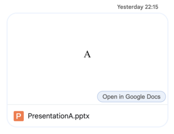

Office Cheets
=============

A colleague has sent you an Excel spreadsheet as an attachment in a Google Chat
message. You don’t have a Microsoft Excel license, and would like to investigate
the spreadsheet using Google Sheets. But clicking on the attachment in Google
Chat only gives you a read-only preview of the spreadsheet. Since the attachment
isn’t in Google Drive, you aren’t able to open it in the Google editor.

This extension adds a button to Microsoft Word, Microsoft Excel, and Microsoft
PowerPoint attachments in Google Chat. Clicking the button uploads the
attachment to your Google Drive, and opens it in a new tab using Google Docs.

## Usage
Click the “Open in Google Docs” button on a Google Chat attachment to upload
the file to your Google Drive and open it using Google’s editor.

## Install

### Set up a Google Cloud Platform project and OAuth client ID

1. Create a Google Cloud Platform project.
2. Configure an OAuth consent screen.
3. Create an OAuth client ID of type “Chrome extension”. If you don’t want to
   create your own extension ID, you can use the pre-configured extension ID
   “cafkdhdkelikhjcemdahbffceeadmonm” specified by the “key” field in
   “manifest.json”.
4. Add the Google Drive API to your GCP project.
5. Add the Google Chat API to your GCP project.
6. Configure the Google Chat API in your GCP project.

### Install the extension

1. Clone this repository:
   `git clone https://github.com/teddywing/office-cheets.git`.
2. Edit “manifest.json”, replacing the `oauth2.client_id` value with the
   client ID you created in the GCP setup step #3.
3. In Google Chrome, open `chrome://extensions/`.
4. Turn on “Developer mode”.
5. Click the “Load unpacked” button.
6. Select the cloned “office-cheets” repository folder.
7. Reload Google Chat to initialise the ‘open attachment’ buttons.

## License
Copyright © 2024 Teddy Wing. Licensed under the GNU GPLv3+ (see the included
COPYING file).
